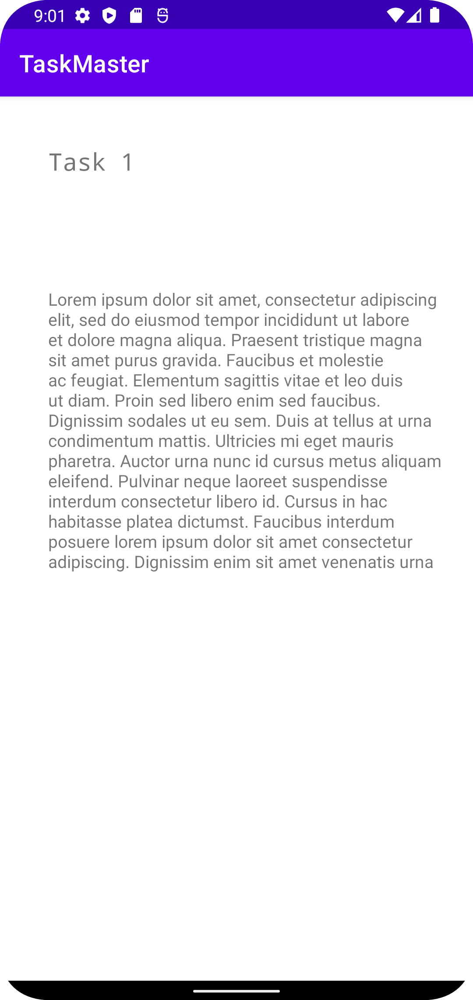

# TaskMaster

Coded by Robb Alexander, 2022

## Change Log

### 03/21/22 (Lab 26: Beginning TaskMaster)

* Initial project built
  
* Created initial activities per wireframe provided

  * Main activity renamed to **MyTasks**

  * **AddTask** activity added

  * **MyTasks** activity added

* Added non-functional UI elements

  * Added event listener to submit button on AddTaskActivity

* Screenshots:

  * 

* APK created; copy located in project root

### 03/22/22 (Lab 27: Data in TaskMaster)

* Added activities:

  * **TaskDetail**

  * **Settings**

* Added intent *from* MyTasks *to* TaskDetail

  * Wired into buttons (TaskDetail title conditioned on particular button clicked)

* Added intent *from* MyTasks *to* Settings

  * Wired into button

* Screenshots:

  * 

  * 

* Updated APK in root

### 03/23/22 (Lab 28: RecyclerViews for Displaying Lists of Data)

* Added RecyclerView functionality:

    * **MyTasksRecyclerViewAdapter** class

    * **fragment_task* fragment for

    * **Task** class created

* Debug:

    * Fixed main title username display only updating on app restart

* Screenshots:

    * 

* Updated APK in root

### 3/24/22 (Lab 29: Room)

* Added dependencies and annotations for [Room](https://developer.android.com/jetpack/androidx/releases/room) database support

    - Refactored **Task** class as @Entity for database usage

* TaskDetail activity pulls

* Screenshots:
    * 

### 3/28/22 (Lab 31: Espresso & Polish)

* Fixed crash on task selection after Room integration

* Fixed newly added Tasks only populating main page after app restart

* Screenshots:

* Added Espresso tests (note-- 1 Task is hard-coded to allow for some Intention testing after Room feature integration)
  * 

### 3/29/22 (Lab 32: Amplify and DynamoDB)

* Removed all previous Room functionality and references

* Removed existing data models for Task objects

  * Replaced with AWS-generated classes per schema (along with enum for field `progress`)

* Added AWS Amplify functionality for database use

### 3/30/22 (Lab 33: Related Data)

* Added Team model with one-to-many relationship to Task
    * Updated references to Task and constructors in-app accordingly

### 4/4/22 (Lab 36: Cognito)

* Integrated AWS Cognito framework for user authentication.

  * Added related activities: VerifyUser; SignUp; LogIn.

  * Added intents (via button) on main activity to access new auth-related activities.

  * Added Gradle dependencies for Cognito libraries.

* Added an updated .apk to root directory

### 4/6/22 (Lab 38: Intent Filters)

* Added `intent-filter` to manifest for addition / editing of Task fields from external activities.

* WIP -- adding file upload functionality to TaskDetail activity

* Set "Log In" & "Log Out" buttons on main page to use identical layout constraints with mutually exclusive rendering

* Screenshots: 

* Added updated .apk to root directory
